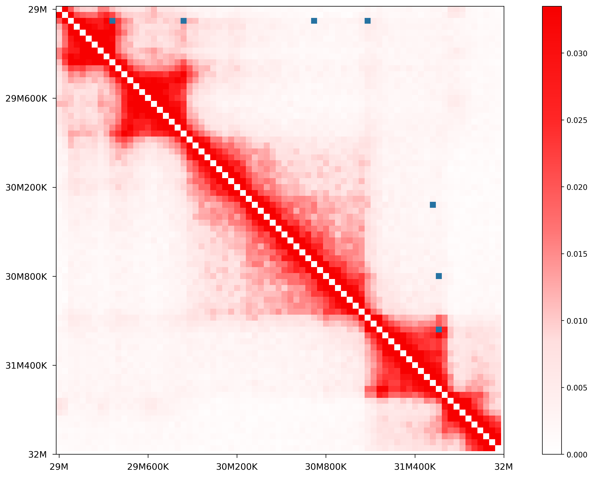
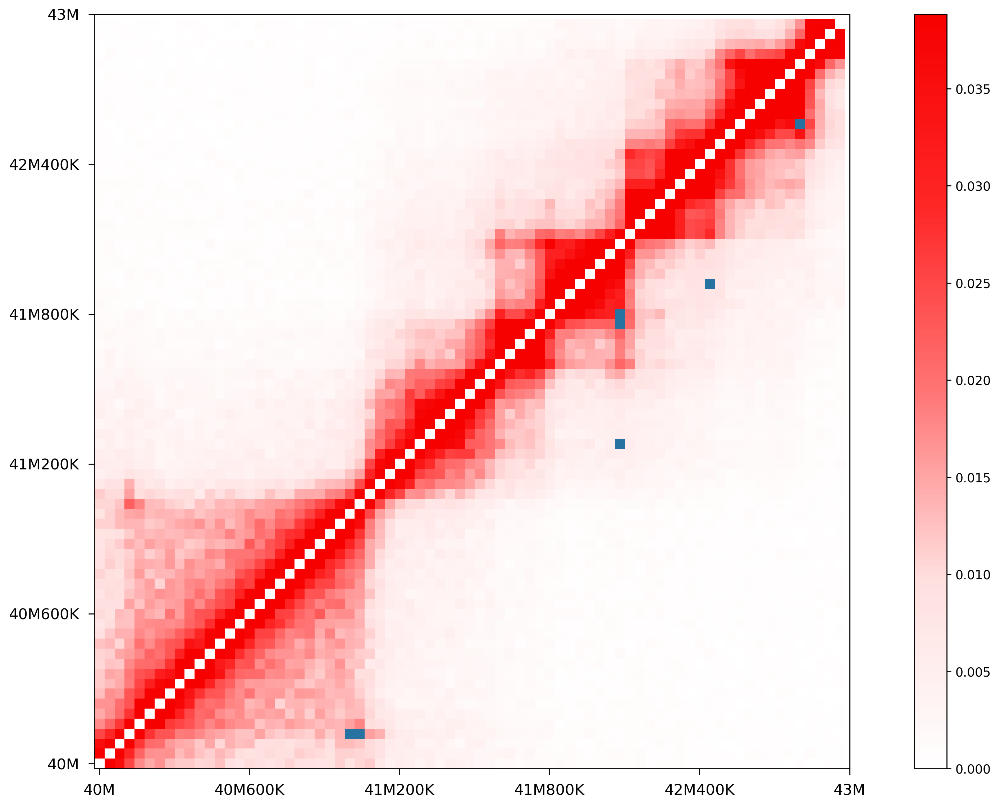

HiCPeaks
========
*hicpeaks* provide a Python CPU-based implementation for BH-FDR and HiCCUPS, two peak calling algorithms
for Hi-C data, proposed by Rao et al [1]_.

Installation
============
*hicpeaks* is developed and tested on UNIX-like operating system, and following packages or softwares are
required:

Python requirements:

a) Python 2.7/3.5+
b) Multiprocess
c) Numpy
d) Scipy
e) Matplotlib
f) Pandas
g) Statsmodels
h) Scikit-Learn
i) H5py
j) Cooler

Other requirements:

- ucsc-fetchchromsizes

*conda*, an excellent package manager, can be used to install all requirements above.

Install Conda
-------------
.. note:: If you have the Anaconda Distribution installed, you already have it.

Choose an appropriate `Miniconda installer <https://conda.io/miniconda.html>`_ for your system,
then in your terminal window type the following and follow the prompts on the installer screens::

    $ bash Miniconda2-latest-Linux-x86_64.sh

After that, update the environment variables to finish the Conda installation::

    $ source ~/.bashrc

Install Packages through Conda
------------------------------
First set up the channels to make all packages listed above accessible (note that the order is
important to guarantee the correct priority)::
    
    $ conda config --add channels defaults
    $ conda config --add channels bioconda
    $ conda config --add channels conda-forge

Then just type and execute the following command::

    $ conda install numpy scipy matplotlib pandas statsmodels scikit-learn h5py multiprocess cooler ucsc-fetchchromsizes

Install hicpeaks
----------------
Now download the `hicpeaks source code <https://pypi.org/project/hicpeaks/>`_ from PyPI, extract it and run
the setup.py script::

    $ python setup.py install

Overview
========
*hicpeaks* comes with 6 scripts: *toCooler*, *pyBHFDR*, *pyHICCUPS*, *combine-resolutions*, *peak-plot* and *apa-analysis*.

- toCooler

  Store TXT/NPZ bin-level Hi-C data into `cooler <https://github.com/mirnylab/cooler>`_ container.

  1. I have included a sample data with *hicpeaks* source code to illustrate how you should prepare your
     data in TXT format. It's quite easy, just remember 3 points: 1. the file name should follow this pattern
     "chrom1_chrom2.txt" (remove prefix from your chromosome labels, i.e. "chr1" should be "1", and "chrX" should
     be "X"); 2. each file should only contain 3 columns, corresponding to "bin1" of "chrom1", "bin2" of "chrom2",
     and "contact frequency" (**don't** perform any normalization processes); 3. all files at the same resolution
     should be placed under a single folder.
  2. NPZ format is another bin-level Hi-C data container which can extremely speed up data loading. *hicpeaks*
     supports NPZ files generated by old version of `runHiC (<0.8.0) <https://github.com/XiaoTaoWang/HiC_pipeline>`_ and
     `TADLib (<0.4.0) <https://github.com/XiaoTaoWang/TADLib>`_.

- pyBHFDR

  A CPU-based python implementation for BH-FDR algorithm. Rao et al (2014) states in their supplementary material that
  this algorithm is robust enough to obtain all main results of their paper. Compared with HiCCUPS, BH-FDR doesn't use
  λ-chunk in multiple hypothesis test, and only considers the Donut background region when calculating the
  expected values.

- pyHICCUPS

  A CPU-based python implementation for HiCCUPS algorithm. Besides the donut region, HiCCUPS also considers the
  lower-left, vertical and horizontal backgrounds when calculating the expected values. And λ-chunk is used to overcome
  several multiple hypothesis testing challenges for Hi-C data. Finally, while BH-FDR has to limit the detected pixels
  near the diagonal (<2Mb), HiCCUPS is able to generalize itself to any genomic distance in theory. Here, *pyHICCUPS*
  keeps all main concepts of the original algorithm except for these points:

  1. *pyHICCUPS* excludes vertical and horizontal backgrounds from its calculation.
  2. There are two critical parameters related to the loop definition in HiCCUPS: the peak width *p* and the donut width *w*.
     In original implementation, they are set exclusively for each certain resolution, specifically, *p=1* and *w=3* at 25Kb,
     *p=2* and *w=5* at 10Kb, and *p=4* and *w=7* at 5Kb. To improve the sensitivity, *pyHICCUPS* calculates and outputs
     the union of the peak calls from all parameter settings *(1,3)*, *(2,5)*, *(4,7)* in a single run.
  3. Due to computational complexity, you should still limit the genomic distance of 2 loci to some degree (5Mb/10Mb).

- combine-resolutions

  Combine peak calls from different resolutions in a way similar to original *HiCCUPS*. Briefly, it excludes redundant lower
  resolution peaks while filters out low-confidence high resolution peaks.

- peak-plot

  Visualize peaks (or loops) detected by *pyBHFDR* or *pyHICCUPS* on heatmap. Just provide a cooler file, a loop
  annotation file in *bedpe* format, and input your interested region (chrom, start, end).

- apa-analysis

  Perform Aggregate Peak Analysis (APA). The inputs are a Hi-C matrix in *.cool* format and a loop annotation file in
  *.bedpe* format.

QuickStart
==========
This tutorial will guide you through the basic usage of all scripts distributed with *hicpeaks*.

toCooler
--------
If you have already created a cooler file for your Hi-C data, skip to the next section
`pyBHFDR and pyHICCUPS <https://github.com/XiaoTaoWang/HiCPeaks/blob/master/README.rst#pybhfdr-and-pyhiccups>`_,
go on otherwise.

First, you should store your TXT/NPZ bin-level Hi-C data into a cooler file by using *toCooler*. Let's begin
with our sample data below. Suppose you are still in the *hicpeaks* distribution root folder: change your current
working directory to the sub-folder *example*::

    $ cd example
    $ ls -lh *

    -rw-r--r--  1 xtwang  staff    18B Aug 21 19:46 datasets
    -rw-r--r--  1 xtwang  staff   293B Aug 23 20:53 hg38.chromsizes

    40K:
    total 11608
    -rw-r--r--  1 xtwang  staff   2.7M Aug 21 19:44 21_21.txt
    -rw-r--r--  1 xtwang  staff   2.9M Aug 21 19:44 22_22.txt

There are one sub-directory called *40K* which contains Hi-C data of two chromosomes in K562 cell line at 40K resolution,
and one metadata file *datasets* which we can pass directly to *toCooler*::

    $ cd 40K
    $ head -5 21_21.txt

    250	251	1
    250	258	1
    250	259	1
    250	260	4
    250	261	2

    $ cd ..
    $ cat datasets

    res:40000
      ./40K

You should construct your TXT files (no head, no tail) with 3 columns, which indicate "bin1 of the 1st chromosome",
"bin2 of the 2nd chromosome" and "contact frequency" respectively. See `Overview <https://github.com/XiaoTaoWang/HiCPeaks#overview>`_
above.

To transform this data to *cooler* format, just run the command below::

    $ toCooler -O K562-MboI-parts.cool -d datasets --assembly hg38 --nproc 2

*toCooler* routinely fetch sizes of each chromosome from UCSC with the provided genome assembly name (here hg38).
However, if your reference genome is not holded in UCSC, you can also build a file like "hg38.chromsizes" in
current working directory, and pass the file path to the argument "--chromsizes-file".

Type ``toCooler`` with no arguments on your terminal to print detailed help information for each parameter.

For this datasets, *toCooler* will create a cooler file named "K562-MboI-parts.cool", and your data will be stored under
the URI "K562-MboI-parts.cool::40000".

This tutorial only illustrates a very simple case, in fact the metadata file may contain list of resolutions (if you
have data at different resolutions for the same cell line) and corresponding folder paths (both relative and absolute
path are accepted, and if your data are NPZ format, this path should point to the NPZ file)::

    res:10000
      /absoultepath/10K
    
    res:20000
      ../relativepath/20K
    
    res:40000
      /npzfile/anyprefix.npz

Then *toCooler* will generate a single cooler file storing all the specified data under different cooler URI:
"specified_cooler_path::10000", "specified_cooler_path::20000" and "specified_cooler_path::40000".

pyBHFDR and pyHICCUPS
---------------------
With cooler URI, you can perform peak annotation by *pyBHFDR* or *pyHICCUPS*::

    $ pyBHFDR -O K562-MboI-BHFDR-loops.txt -p K562-MboI-parts.cool::25000 -C 21 --pw 1 --ww 3

Or::

    $ pyHICCUPS -O K562-MboI-HICCUPS-loops.txt -p K562-MboI-parts.cool::25000 --pw 1 2 4 --ww 3 5 7 --only-anchors

Type ``pyBHFDR`` or ``pyHICCUPS`` on your terminal to print detailed help information for each parameter.

Before step to the next section, let's list the contents under current working directory again::

    $ ls -lh

    total 1744
    drwxr-xr-x  5 xtwang  staff   160B Sep  3 14:55 40K
    -rw-r--r--  1 xtwang  staff   3.9K Sep  3 14:58 BHFDR.log
    -rw-r--r--  1 xtwang  staff    17K Sep  3 14:59 HICCUPS.log
    -rw-r--r--  1 xtwang  staff    16K Sep  3 14:58 K562-MboI-BHFDR-loops.txt
    -rw-r--r--  1 xtwang  staff    19K Sep  3 14:59 K562-MboI-HICCUPS-loops.txt
    -rw-r--r--  1 xtwang  staff   704K Sep  3 14:57 K562-MboI-parts.cool
    -rw-r--r--  1 xtwang  staff    18B Sep  3 14:55 datasets
    -rw-r--r--  1 xtwang  staff   293B Sep  3 14:55 hg38.chromsizes
    -rw-r--r--  1 xtwang  staff    29K Sep  3 14:57 tocooler.log

Peak Visualization
------------------
Now, you can visualize BH-FDR and HICCUPS peak annotations on heatmap with *peak-plot*.

For BH-FDR peaks::

    $ peak-plot -O test-BHFDR.png --dpi 200 -p K562-MboI-parts.cool::25000 -I K562-MboI-BHFDR-loops.txt -C 21 -S 20700000 -E 23300000 --correct --skip-rows 1

The output figure should look like this:

For HICCUPS peaks::

    $ peak-plot -O test-HICCUPS.png --dpi 200 -p K562-MboI-parts.cool::25000 -I K562-MboI-HICCUPS-loops.txt -C 21 -S 20700000 -E 23300000 --correct --skip-row 1

And the output plot:

Aggregate Peak Analysis
-----------------------
To inspect the overall loop patterns of the detected peaks, you can use the *apa-analysis* script::

    $ 

Combine different resolutions
-----------------------------
The inputs to *combine-resolutions* are loop annotation files (*bedpe*) at different resolutions. If an interaction
is detected as a peak in both resolutions, this script records the precise coordinates in finer resolutions and discards
the coarser resolution one. And a long-range (determined by the ``--min-dis`` parameter) peak call at high resolutions
(determined by the ``--good-res`` parameter) will be treated as a false positive if it could not be identified at lower
resolutions. Here's a *pseudo* command with 3 loop files at 5Kb, 10Kb, and 20Kb respectively::

    $ combine-resolutions -O K562-MboI-pyHICCUPS-combined.bedpe -p K562-MboI-pyHICCUPS-5K.txt K562-MboI-pyHICCUPS-10K.txt K562-MboI-pyHICCUPS-20K.txt -R 5000 10000 20000 -G 20000 -M 100000

Performance
===========
The tables below show the performance test of *toCooler*, *pyBHFDR* and *pyHICCUPS* with low (T47D) and high (K562)
sequencing data, at low (40K) and high (10K) resolutions.

- Processor: 2.6 GHz Intel Core i7, Memory: 16 GB 2400 MHz DDR4
- Software version: *hicpeaks 0.3.0*
- At 40Kb resolution, ``--pw`` and ``--ww`` are set to 1 and 3 respectively; at 10Kb resolution, they are set to 2
  and 5 respectively.
- The original Hi-C data is stored in TXT
- Number of proccesses assigned: 1
- Valid contacts: total number of non-zero pixels on intra-chromosomal matrices
- Running time format: hr: min: sec

+--------------+----------------+--------------+--------------+--------------+--------------+--------------+--------------+
| Datasets     | Valid contacts |          toCooler           |           pyBHFDR           |          pyHICCUPS          |
+--------------+----------------+--------------+--------------+--------------+--------------+--------------+--------------+
|                               | Memory Usage | Running time | Memory Usage | Running time | Memory Usage | Running time |
+==============+================+==============+==============+==============+==============+==============+==============+
| T47D (40K)   |   25,216,875   |    <600M     |    0:07:55   |    <600M     |    0:01:34   |    <600M     |    0:04:17   |
+--------------+----------------+--------------+--------------+--------------+--------------+--------------+--------------+
| K562 (40K)   |   49,088,465   |    <1.2G     |    0:21:37   |    <1.0G     |    0:01:49   |    <1.0G     |    0:03:21   |
+--------------+----------------+--------------+--------------+--------------+--------------+--------------+--------------+
| K562 (10K)   |  139,884,876   |    <3.0G     |    1:00:07   |    <2.0G     |    0:24:53   |    <4.0G     |    1:57:33   |
+--------------+----------------+--------------+--------------+--------------+--------------+--------------+--------------+

.. note:: Both *pyBHFDR* and *pyHICCUPS* support multiple processes (``--nproc``). If your computer has sufficient memory, the
          calculation should end within 30 minutes even for high resolutions.

Release Notes
=============
Version 0.3.3 (03/08/2019)
--------------------------
- Float matrix support in *toCooler* transformation
- Removed ticklabels in APA plot

Version 0.3.2 (03/03/2019)
--------------------------
1. Supported combination of different resolutions
2. Changed local clustering algorithm
3. Added APA module
4. Compatible with cooler 0.8
5. Old distutils to setuptools

Version 0.3.0 (09/03/2018)
--------------------------
1. Removed horizontal and vertical backgrounds for performance
2. Supported multiple parameters (pw and ww)
3. Supported Python 3
4. Optimized the calculation
5. Code refactoring
6. Fixed bugs when users provide with external .cool files.

Version 0.2.0-r1 (08/26/2018)
-----------------------------
1. Speeded up the program by dynamically limiting donut width
2. Added performance table in README.rst

Version 0.2.0 (08/25/2018)
--------------------------
1. Added vertical and horizontal backgrounds 
2. Added additional filtering based on dbscan clusters and more stringent q value thresholds
3. Fixed bugs in storing interchromosomal data

Version 0.1.1 (08/24/2018)
--------------------------
1. Lower memory usage and more efficient calculation

Version 0.1.0 (08/22/2018)
--------------------------
1. The first release.
2. Added *toCooler* and *peak-plot*.
3. Added multiple process support.

Pre-Release (05/04/2015)
-----------------------------
1. Implemented core algorithms of BH-FDR and HICCUPS

Reference
=========
.. [1] Rao SS, Huntley MH, Durand NC et al. A 3D Map of the Human Genome at Kilobase Resolution
      Reveals Principles of Chromatin Looping. Cell, 2014, 159(7):1665-80.
