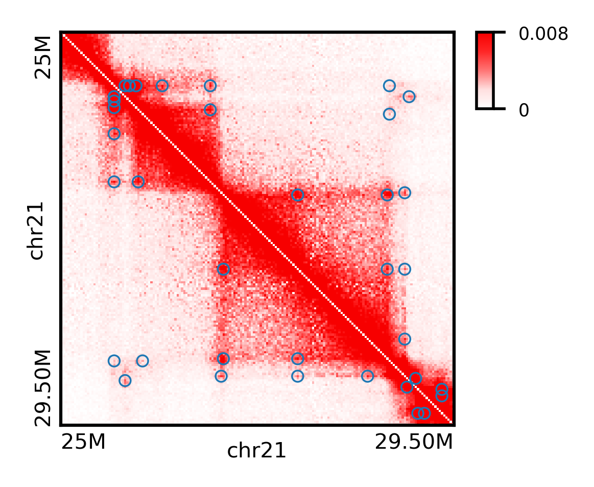
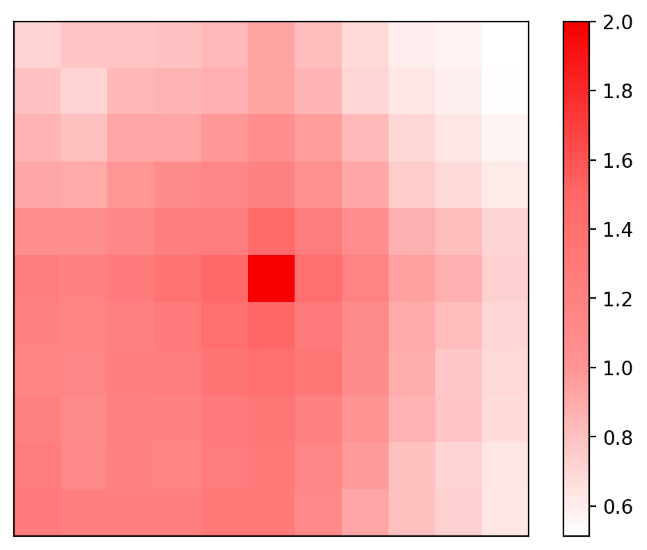

HiCPeaks
========
.. image:: https://static.pepy.tech/personalized-badge/hicpeaks?period=total&units=international_system&left_color=black&right_color=orange&left_text=Downloads
 :target: https://pepy.tech/project/hicpeaks

*hicpeaks* provides a Python implementation for BH-FDR and HiCCUPS [1]_.

Installation
============
*hicpeaks* is developed and tested on UNIX-like operating systems, and the following packages or softwares are
required:

Python requirements:

a) Python 2.7/3.5+
b) Multiprocess
c) Numpy
d) Scipy
e) Matplotlib
f) Pandas
g) Statsmodels
h) Scikit-Learn
i) H5py
j) Cooler

Other requirements:

- ucsc-fetchchromsizes

*conda*, an excellent package manager, can be used to install all requirements above.

Install Requirements Through Conda
----------------------------------
All above requirements can be installed through the conda package manager.

.. note:: If you have the Anaconda Distribution installed, you already have it.

Choose an appropriate `Miniconda installer <https://conda.io/miniconda.html>`_ for your system,
then in your terminal window type the following and follow the prompts on the installer screens::

    $ bash Miniconda3-latest-Linux-x86_64.sh

After that, update the environment variables to finish the Conda installation::

    $ source ~/.bashrc

Next, you need to set up channels to make all packages listed above accessible (note
that the order is important to guarantee the correct priority)::
    
    $ conda config --add channels defaults
    $ conda config --add channels bioconda
    $ conda config --add channels conda-forge

Then type and execute the commands below to satisfy the requirements::

    $ conda create -n HiCPeaks numpy scipy matplotlib pandas statsmodels scikit-learn h5py multiprocess cooler ucsc-fetchchromsizes
    $ conda activate HiCPeaks

Install hicpeaks
----------------
Finally, hicpeaks can be installed from PyPI using pip::

    $ pip install -U hicpeaks

Overview
========
*hicpeaks* comes with 6 scripts: *toCooler*, *pyBHFDR*, *pyHICCUPS*, *combine-resolutions*, *peak-plot*,
and *apa-analysis*.

- toCooler

  Store TXT/NPZ bin-level Hi-C data into the `cooler <https://github.com/mirnylab/cooler>`_ container.

  1. I have included a sample data with the *hicpeaks* source code to illustrate how you should prepare your
     data in TXT format. It's quite easy, just remember 3 points: 1. the file name should follow this pattern
     "chrom1_chrom2.txt" (remove prefix from your chromosome labels, i.e. "chr1" should be "1", and "chrX" should
     be "X"); 2. each file should only contain 3 columns, corresponding to "bin1" of "chrom1", "bin2" of "chrom2",
     and "contact frequency" (**don't** perform any normalization processes); 3. all files at the same resolution
     should be placed in the same folder.
  2. NPZ format is another bin-level Hi-C data container which can extremely speed up data loading. *hicpeaks*
     supports NPZ files generated by old versions of `runHiC (<0.8.0) <https://github.com/XiaoTaoWang/HiC_pipeline>`_ and
     `TADLib (<0.4.0) <https://github.com/XiaoTaoWang/TADLib>`_.

- pyBHFDR

  A CPU-based python implementation for the BH-FDR algorithm. Rao et al (2014) stated in their supplementary material that
  this algorithm is robust enough to obtain all main results of their paper. Compared with HiCCUPS, BH-FDR doesn't use
  λ-chunk in multiple hypothesis tests, and only considers the Donut background region when calculating the
  expected values.

- pyHICCUPS

  A CPU-based python implementation for the HiCCUPS algorithm. Besides the donut region, HiCCUPS also considers the
  lower-left, the vertical, and the horizontal backgrounds when calculating the expected values. And λ-chunk is used
  to overcome several multiple hypothesis testing challenges for Hi-C data. Finally, while BH-FDR can only detect chromatin
  interactions near the diagonal (<2Mb), HiCCUPS is able to detect super long-range interactions. Here, *pyHICCUPS* keeps
  all main concepts of the original algorithm except for these points:

  1. *pyHICCUPS* excludes vertical and horizontal backgrounds from its calculation.
  2. There are two critical parameters related to the loop definition in HiCCUPS: the peak width *p* and the donut width *w*.
     In original implementation, they are set exclusively for each certain resolution, specifically, *p=1* and *w=3* at 25Kb,
     *p=2* and *w=5* at 10Kb, and *p=4* and *w=7* at 5Kb. To improve the sensitivity, *pyHICCUPS* can calculate and output
     the union peak calls from all parameter combinations *(1,3)*, *(2,5)*, *(4,7)* in a single run.
  3. Due to computational complexity, the search space still need to be limited, for example, within 5Mb/10Mb.

- combine-resolutions

  Combine peak calls from different resolutions in a way similar to original *HiCCUPS*. Briefly, it excludes redundant lower
  resolution peaks while filters out low-confidence high resolution peaks.

- peak-plot

  Visualize peaks (or chromatin loops) on a local contact matrix.

- apa-analysis

  Perform Aggregate Peak Analysis (APA).

QuickStart
==========
This tutorial will guide you through the basic usage of all scripts distributed with *hicpeaks*.

toCooler
--------
If you have already created a cooler file for your Hi-C data, skip to the next section
`pyBHFDR and pyHICCUPS <https://github.com/XiaoTaoWang/HiCPeaks/blob/master/README.rst#pybhfdr-and-pyhiccups>`_,
go on otherwise.

First, you should store your TXT/NPZ bin-level Hi-C data into a cooler file by using *toCooler*. Let's begin
with our sample data below. Suppose you are in the *hicpeaks* source code root folder: change your current
working directory to the sub-folder *example*::

    $ cd example
    $ ls -lh *

    -rw-r--r-- 1 xtwang  18 May  4 18:00 datasets
    -rw-r--r-- 1 xtwang 293 May  4 18:00 hg38.chromsizes

    25K:
    total 12M
    -rw-r--r-- 1 xtwang 12M May  4 18:00 21_21.txt

There is a sub-directory called *25K* and a metadata file called *datasets*. The *25K* folder contains chromatin
interactions of chromosome 21 of the K562 cell line at the 25K resolution, and the *datasets* describes the data
that need to be transformed::

    $ cd 25K
    $ head -5 21_21.txt

    201	703	1
    201	1347	1
    201	1351	1
    201	1524	1
    201	1691	1

    $ cd ..
    $ cat datasets

    res:25000
      ./25K

You should construct your TXT files (no head, no tail) with 3 columns, which indicate "bin1 of the 1st chromosome",
"bin2 of the 2nd chromosome", and "contact frequency" respectively. See `Overview <https://github.com/XiaoTaoWang/HiCPeaks#overview>`_
above.

To transform this data to the *cooler* format, just run the command below::

    $ toCooler -O K562-MboI-parts.cool -d datasets --assembly hg38 --nproc 1

*toCooler* routinely fetch sizes of each chromosome from UCSC with the provided genome assembly name (here hg38).
However, if your reference genome is not holded in UCSC, you can also build a file like "hg38.chromsizes" in
current working directory, and pass the file path to the argument "--chromsizes-file".

Type ``toCooler`` with no arguments on your terminal to print detailed help information for each parameter.

For this dataset, *toCooler* will create a cooler file named "K562-MboI-parts.cool", and your data will be stored under
the URI "K562-MboI-parts.cool::25000".

This tutorial only illustrates a very simple case, in fact the metadata file may contain list of resolutions (if you
have data at different resolutions for the same cell line) and corresponding folder paths (both relative and absolute
path are accepted, and if your data are in the NPZ format, this path should point to the NPZ file)::

    res:10000
      /absoultepath/10K
    
    res:25000
      ../relativepath/25K
    
    res:40000
      /npzfile/anyprefix.npz

Then *toCooler* will generate a single cooler file storing all the specified data under different cooler URI.
Suppose your cool file is named "specified_cooler_path", the above data will be stored at
"specified_cooler_path::10000", "specified_cooler_path::25000", and "specified_cooler_path::40000", respectively.

pyBHFDR and pyHICCUPS
---------------------
After you have obtained a cool file, you can call peaks or chromatin loops using *pyBHFDR* or *pyHICCUPS*::

    $ pyBHFDR -O K562-MboI-BHFDR-loops.txt -p K562-MboI-parts.cool::25000 -C 21 --pw 1 --ww 3

Or::

    $ pyHICCUPS -O K562-MboI-HICCUPS-loops.txt -p K562-MboI-parts.cool::25000 --pw 1 2 4 --ww 3 5 7 --only-anchors

Type ``pyBHFDR`` or ``pyHICCUPS`` on your terminal to print detailed help information for each parameter.

Before step to the next section, let's list the contents under current working directory again::

    $ ls -lh

    total 852K
    drwxr-xr-x 4 xtwang  128 May  4 18:21 25K/
    -rw-r--r-- 1 xtwang  17K May  4 18:23 K562-MboI-BHFDR-loops.txt
    -rw-r--r-- 1 xtwang  15K May  4 18:23 K562-MboI-HICCUPS-loops.txt
    -rw-r--r-- 1 xtwang 723K May  4 18:22 K562-MboI-parts.cool
    -rw-r--r-- 1 xtwang   18 May  4 18:21 datasets
    -rw-r--r-- 1 xtwang  293 May  4 18:21 hg38.chromsizes
    -rw-r--r-- 1 xtwang 2.2K May  4 18:23 pyBHFDR.log
    -rw-r--r-- 1 xtwang 8.5K May  4 18:23 pyHICCUPS.log
    -rw-r--r-- 1 xtwang  17K May  4 18:22 tocooler.log

The detected loops are reported in a customized `bedpe <https://bedtools.readthedocs.io/en/latest/content/general-usage.html#bedpe-format>`_
format. The first 10 columns are identical to the `official definition <https://bedtools.readthedocs.io/en/latest/content/general-usage.html#bedpe-format>`_,
and the additional fields are:

11. Fold enrichment score calculated from the donut background.
12. The p value calculated from the donut background.
13. The q value calculated from the donut background.
14. Fold enrichment score calculated from the lower-left background.
15. The p value calculated from the lower-left background.
16. The q value calculated from the lower-left background.

Peak Visualization
------------------
Now, you can visualize the detected peaks/loops using *peak-plot*::

    $ peak-plot -O test-HICCUPS.png -p K562-MboI-parts.cool::25000 -I K562-MboI-HICCUPS-loops.txt \
      -C 21 -S 25000000 -E 29500000 --clr-weight-name weight --vmin 0 --vmax 0.008

The output figure should look like this:

Aggregate Peak Analysis
-----------------------
To inspect the overall loop patterns of the detected peaks, you can use the *apa-analysis* script::

    $ apa-analysis -O apa.png -p K562-MboI-parts.cool::25000 -I K562-MboI-HICCUPS-loops.txt --clr-weight-name weight --vmax 2

The output plot should look like this:

Combine different resolutions
-----------------------------
The inputs to *combine-resolutions* are loop annotation files (*bedpe*) at different resolutions. If an interaction
is detected as a peak in both resolutions, this script records the precise coordinates in finer resolutions and discards
the coarser resolution one. And a long-range (determined by the ``--min-dis`` parameter) peak call at high resolutions
(any resolutions lower than the ``--good-res`` cutoff, note that lower values correspond to higher resolutions) will be
treated as a false positive if it could not be identified at lower resolutions (any resolutions equal to or greater than
the ``--good-res`` cutoff). Here's a *pseudo* command with 3 loop files at 5Kb, 10Kb, and 20Kb respectively::

    $ combine-resolutions -O K562-MboI-pyHICCUPS-combined.bedpe -p K562-MboI-pyHICCUPS-5K.txt K562-MboI-pyHICCUPS-10K.txt K562-MboI-pyHICCUPS-20K.txt -R 5000 10000 20000 -G 20000 -M 100000

Performance
===========
The table below shows a performance test for the *toCooler*, *pyBHFDR* , and *pyHICCUPS* scripts:

- Processor: 2.6 GHz Intel Core i7, Memory: 16 GB 2400 MHz DDR4
- Software version: *hicpeaks 0.3.0*
- At the 40Kb resolution, ``--pw`` and ``--ww`` are set to 1 and 3, respectively; at the 10Kb resolution,
  they are set to 2 and 5, respectively.
- The original Hi-C data is stored in TXT
- Number of proccesses assigned: 1
- Valid contacts: total number of non-zero pixels in intra-chromosomal matrices
- Running time format: hr: min: sec

+--------------+----------------+--------------+--------------+--------------+--------------+--------------+--------------+
| Datasets     | Valid contacts |          toCooler           |           pyBHFDR           |          pyHICCUPS          |
+--------------+----------------+--------------+--------------+--------------+--------------+--------------+--------------+
|                               | Memory Usage | Running time | Memory Usage | Running time | Memory Usage | Running time |
+==============+================+==============+==============+==============+==============+==============+==============+
| T47D (40K)   |   25,216,875   |    <600M     |    0:07:55   |    <600M     |    0:01:34   |    <600M     |    0:04:17   |
+--------------+----------------+--------------+--------------+--------------+--------------+--------------+--------------+
| K562 (40K)   |   49,088,465   |    <1.2G     |    0:21:37   |    <1.0G     |    0:01:49   |    <1.0G     |    0:03:21   |
+--------------+----------------+--------------+--------------+--------------+--------------+--------------+--------------+
| K562 (10K)   |  139,884,876   |    <3.0G     |    1:00:07   |    <2.0G     |    0:24:53   |    <4.0G     |    1:57:33   |
+--------------+----------------+--------------+--------------+--------------+--------------+--------------+--------------+

.. note:: Both *pyBHFDR* and *pyHICCUPS* support parallel computation (``--nproc``). If your computer has sufficient memory, the
          calculation should end within 30 minutes even for high-resolution matrices.

Release Notes
=============
Version 0.3.5 (08/28/2022)
--------------------------
- Added parameters to *peak-plot* and *apa-analysis* so that the output figures can be more finely tuned

Version 0.3.4 (05/04/2019)
--------------------------
- Improved the efficiency of the local clustering algorithm
- Changed the output loop format to bedpe

Version 0.3.3 (03/08/2019)
--------------------------
- Made *toCooler* support the float data type
- Removed ticklabels in APA plot

Version 0.3.2 (03/03/2019)
--------------------------
- Supported combination of different resolutions
- Improved the local clustering algorithm
- Added the APA analysis module
- Dealed with the compatiblility with cooler 0.8

Version 0.3.0 (09/03/2018)
--------------------------
- Removed the horizontal and vertical backgrounds
- Supported multiple combinations of the *pw* and *ww* parameters
- Migrated to Python 3
- Optimized the calculation efficiency
- Fixed bugs when external .cool files are provided.

Version 0.2.0-r1 (08/26/2018)
-----------------------------
- Speeded up the program by dynamically limiting the donut widths

Version 0.2.0 (08/25/2018)
--------------------------
- Added the vertical and horizontal backgrounds 
- Added additional filtering procedures based on the dbscan clusters and more stringent q value cutoffs
- Fixed bugs of *toCooler* in storing the inter-chromosomal data

Version 0.1.1 (08/24/2018)
--------------------------
- Lower memory usage and more efficient calculation

Version 0.1.0 (08/22/2018)
--------------------------
- The first release.
- Added *toCooler* and *peak-plot*.
- Added support for multiple processing.

Pre-Release (05/04/2015)
-----------------------------
- Implemented core algorithms of BH-FDR and HICCUPS

Reference
=========
.. [1] Rao SS, Huntley MH, Durand NC et al. A 3D Map of the Human Genome at Kilobase Resolution
      Reveals Principles of Chromatin Looping. Cell, 2014, 159(7):1665-80.
